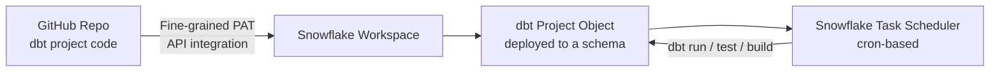

# dbt on Snowflake (CoCo): Native IDE + GitHub Integration POC

## 1. Executive Summary

This document outlines the technical framework for integrating dbt directly within the Snowflake environment. By leveraging Snowflake's native dbt integration, organizations can execute dbt core functionalities—including modeling, testing, and scheduling—directly on Snowflake compute resources. This architecture minimizes the need for external orchestration tools like Airflow or dbt Cloud, utilizing Snowflake's internal task scheduler and Git API integrations.

## 2. Architecture and Foundational Setup

The integration follows a "Push-to-Snowflake" model where the code resides in a version control system (GitHub) but the execution and state management occur within Snowflake.



### 2.1 Workspace Infrastructure

A Snowflake Workspace serves as the central hub for the dbt project. It maintains a persistent connection to a GitHub repository.

- **Connection Protocol:** Integration is established via an API integration using a Fine-Grained Personal Access Token (PAT).
- **Credential Management:** Snowflake Secrets are utilized to store GitHub usernames and PATs securely, ensuring that sensitive credentials are not hardcoded.
- **Database Objects:** For every workspace, a dedicated database and schema must be initialized to house the metadata and the GitHub integration objects.

### 2.2 GitHub Integration Workflow

1. **Token Generation:** A fine-grained PAT is generated in GitHub Developer Settings with specific repository permissions.
2. **Secret Creation:** A secret object is created in Snowflake using the `TYPE = PASSWORD` parameter, where the password is the PAT.
3. **Integration Object:** A `GITHUB_INTEGRATION` object is created to verify the connection and allow Snowflake to fetch the repository contents.

## 3. Development and Execution

Once the workspace is connected, users interact with dbt through a web-based console within the Snowflake UI.

### 3.1 Command Execution

Standard dbt CLI commands are supported natively. The UI provides a command bar where users can input:

- `dbt run`: Executes models against the Snowflake warehouse.
- `dbt test`: Runs data quality tests defined in YAML files.
- `dbt build`: Performs a combination of run, test, and seed.
- `dbt seed`: Loads CSV files into Snowflake tables.
- **Flags:** Users can append flags such as `--select`, `--exclude`, or `--full-refresh` directly in the UI text box.

### 3.2 Visual Lineage (DAG)

Snowflake automatically constructs a Directed Acyclic Graph (DAG) based on the `ref()` functions within the dbt models.

- **Dependency Tracking:** The UI allows users to click on specific nodes in the DAG to execute upstream or downstream dependencies.
- **Debugging:** Lineage visibility aids in identifying which specific model in a chain failed, facilitating faster root-cause analysis.

### 3.3 Advanced Logic

- **Macros and Jinja:** The integration supports full Jinja templating. Custom macros stored in the `macros/` folder are recognized and executed by the Snowflake engine.
- **Package Management:** Dependencies defined in `packages.yml` are handled via the `dbt deps` command, which can be configured to run automatically during deployment.

## 4. Version Control and Branching

While Snowflake provides a UI for Git operations, it does not replace a full Git CLI.

### 4.1 Supported Operations

- **Branching:** Users can create new feature branches from the main branch directly within the Snowflake UI.
- **Commits:** Changes made to SQL files or YAML configurations can be committed with a message and pushed to the remote repository.
- **Syncing:** To reflect changes merged by other team members, users must manually trigger a "Pull" operation to update the Snowflake environment.

### 4.2 Known Limitations

The integrated environment is optimized for standard workflows and currently lacks support for complex Git operations:

- **No Stash/Pop:** Users cannot temporarily shelve changes without committing.
- **No Rebase:** All branch synchronization must follow standard merge patterns; rebasing is currently unavailable.
- **External Approvals:** Pull Requests (PRs) cannot be approved or merged within Snowflake. This must be performed on the GitHub platform to maintain governance and peer-review standards.

## 5. Deployment and Orchestration

The primary advantage of this integration is the elimination of external overhead for production scheduling.

### 5.1 Scheduling with Snowflake Tasks

Deployment involves creating a dbt "Object" in a production-ready database/schema.

- **Environment Targeting:** The `profiles.yml` file is configured to distinguish between dev and prod targets.
- **Cron Scheduling:** Tasks can be scheduled using standard Cron expressions or predefined intervals (e.g., "Every few minutes").
- **Timezone Support:** Schedules can be localized to specific time zones to align with business reporting requirements.

### 5.2 Observability and Maintenance

- **Query History:** Detailed logs of every SQL statement generated by dbt are available in the Snowflake Query History.
- **Task History:** A specialized view tracks the success, failure, and duration of scheduled dbt runs.
- **Run Logs:** Standard dbt console output is captured and stored, allowing users to see exactly why a specific model or test failed during an automated run.

## 6. Implementation Reference: SQL Setup Scripts and Data Structures

To facilitate the deployment of the architecture described above, use the following SQL scripts. These scripts initialize the necessary security integrations, secrets, and tracking tables for monitoring dbt task execution.

### 6.1 Security and Git Integration Setup

These commands establish the secure handshake between Snowflake and GitHub.

```sql
-- 1. Create a dedicated database for dbt metadata and secrets
CREATE DATABASE IF NOT EXISTS DBT_METADATA;
CREATE SCHEMA IF NOT EXISTS DBT_METADATA.INTEGRATIONS;

-- 2. Create the Secret object to store the GitHub PAT
CREATE OR REPLACE SECRET DBT_METADATA.INTEGRATIONS.GITHUB_PAT_SECRET
    TYPE = PASSWORD
    USERNAME = 'your_github_username'
    PASSWORD = 'your_fine_grained_access_token';

-- 3. Create the API Integration for the GitHub Repository
CREATE OR REPLACE API INTEGRATION GITHUB_DBT_INTEGRATION
    API_ALLOWED_LOCATIONS = ('https://github.com/your-org/your-repo.git')
    API_PROVIDER = GIT_HTTPS_API
    ENABLED = TRUE;

-- 4. Create the Git Repository Object in Snowflake
CREATE OR REPLACE GIT REPOSITORY DBT_METADATA.INTEGRATIONS.PROJECT_REPO
    API_INTEGRATION = GITHUB_DBT_INTEGRATION
    GIT_CREDENTIALS = DBT_METADATA.INTEGRATIONS.GITHUB_PAT_SECRET
    ORIGIN = 'https://github.com/your-org/your-repo.git';
```

### 6.2 Automated Scheduling Example

The following script demonstrates how to wrap a dbt operation inside a Snowflake Task using the integration created.

```sql
-- Create a task that runs every minute
create or replace task SNOWFLAKE_LEARNING_DB.PUBLIC.DEMO_SCHEDULE
 warehouse=COMPUTE_WH
 schedule='USING CRON */1 * * * * Asia/Colombo'
 as EXECUTE dbt project DEMO_DEPLOY args='run --target dev';

-- Note: In the Native UI, you would typically use the 'Deploy'
-- interface to define the 'dbt build' command directly.
```

## 7. Summary of Workflow Requirements

- **Prerequisites:** A Snowflake user with `ACCOUNTADMIN` or `SECURITYADMIN` privileges is required to create the API Integration.
- **Maintenance:** The GitHub PAT stored in the Secret object must be rotated according to your organization's security policy (typically every 90 days).
- **Validation:** After running `dbt deps` via the UI, verify that the `dbt_packages` folder is populated before attempting a full project build.

### 🎥 Demo recording

<iframe src="https://drive.google.com/file/d/1BF3IIIw37TnUWmZay2EuV41oETbgfUs9/preview" style="width:100%; aspect-ratio:16/9;" allow="autoplay"></iframe>

#### 📝 Meeting Details

**Topic:** Demo dbt on Snowflake
**Date:** February 16, 2026
**Host:** Harsh Sharma

**Key Discussion Points**

- DBT–Snowflake integration architecture: a Snowflake workspace connects to a GitHub repo hosting the dbt project via an API integration using a fine-grained personal access token (PAT).
- Native command execution and scheduling: standard dbt commands (`run`, `test`, `build`) execute natively on Snowflake compute, with automatic task scheduling via Snowflake's built-in scheduler — no external orchestrator (Airflow, dbt Cloud) needed.
- Git limitations discussed: branching and commits are supported in the Snowflake UI, but stash/pop and rebase are currently unavailable.

### 📊 Demo slides

<iframe src="https://drive.google.com/file/d/1vA-_zpuZ8FbuG0GWxuVUEYMX0j5QuO6f/preview" style="width:100%; aspect-ratio:640/389;"></iframe>

## Related

- [dbt project organization](../dbt/dbt-project-organization.md)
- [Orchestration: Dagster case study](../../concepts/data-engineering/orchestration/dagster-poc.md) — for comparison against an external orchestrator
- [CI/CD](../../concepts/devops-and-infrastructure/cicd.md)
